# 🤖 AI Developer Program

> **Build, ship, and operate production-grade AI applications** — from your first LLM API call to multi-agent systems running on the cloud with guardrails, observability, and CI/CD.

---

## 📋 Program at a Glance

| | |
|---|---|
| ⏱️ **Duration** | 3 Months (12 weeks) |
| 🗓️ **Format** | Weekly modules · hands-on labs · weekly mini-projects · capstone |
| 🧑‍💻 **Core Languages** | 🐍 Python · 🗄️ SQL |
| ☁️ **Cloud** | AWS (Amazon Bedrock, ECS/Lambda, RDS) |
| 🧠 **AI Stack** | LangGraph · Bedrock · RAG · PGVector · Milvus · MCP |
| 🎯 **Outcome** | A deployed, monitored, guard-railed agentic AI capstone in your portfolio |

---

## 🎯 Target Job Roles

| Role | 💼 What they do | 🔑 Program focus |
|---|---|---|
| 🛠️ **AI Developer** | Build LLM-powered features, RAG apps, and agents | LLM APIs, RAG, LangGraph, Agents |
| 🏗️ **AI Platform Engineer** | Build the shared infrastructure teams use to ship AI | Vector DBs, MLOps, Observability, Deployment |
| 🚀 **AI Forward Deployed Engineer** | Embed with customers to deliver AI solutions end-to-end | MCP integrations, Guardrails, rapid prototyping, demos |

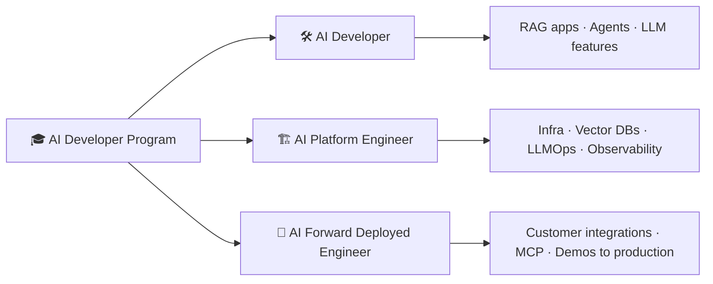

---

## 🧭 Learning Path

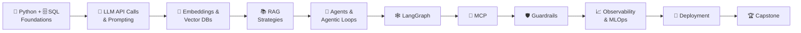

---

## 🗓️ 12-Week Timeline

> Dates are illustrative — the schedule shifts to each cohort's start date.

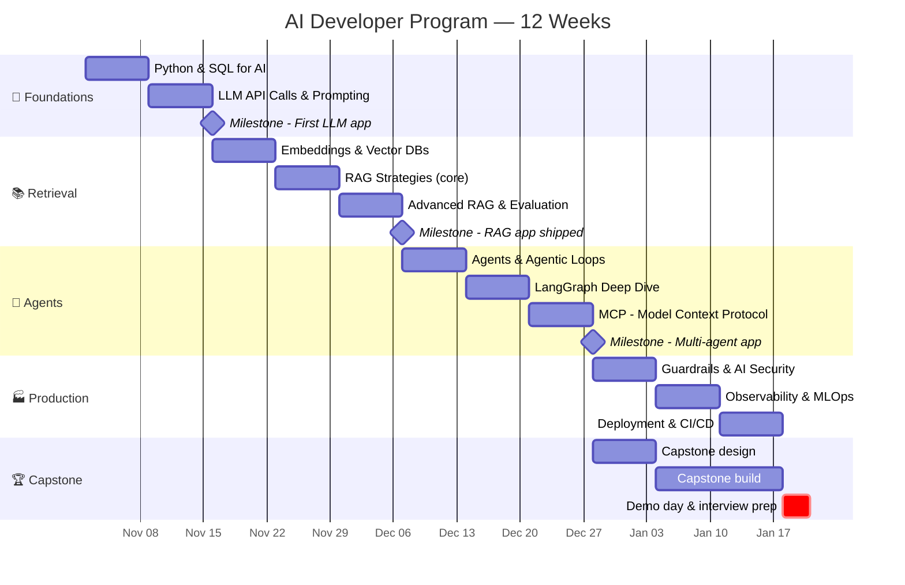

### 📅 Week-by-Week Breakdown

| Week | Phase | Module | 🧪 Hands-on Deliverable |
|:---:|---|---|---|
| 1 | 🧱 Foundations | Python & SQL for AI | Async API client + SQL analytics on a sample dataset |
| 2 | 🧱 Foundations | LLM API Calls & Prompting | CLI chatbot with streaming, tool calls, and structured JSON output |
| 3 | 📚 Retrieval | Embeddings & Vector DBs | Semantic search over docs using PGVector and Milvus |
| 4 | 📚 Retrieval | RAG Strategies (core) | Q&A bot over a PDF knowledge base |
| 5 | 📚 Retrieval | Advanced RAG & Evaluation | Hybrid search + re-ranking with an eval report |
| 6 | 🤖 Agents | Agents & Agentic Loops | Tool-using agent built from scratch (no framework) |
| 7 | 🤖 Agents | LangGraph | Stateful multi-step workflow with human-in-the-loop |
| 8 | 🤖 Agents | MCP | Custom MCP server exposing internal tools/data |
| 9 | 🏭 Production | Guardrails & Security | Input/output guardrails + prompt-injection test suite |
| 10 | 🏭 Production | Observability & MLOps | Tracing, cost dashboards, prompt versioning |
| 11 | 🏭 Production | Deployment | Containerized app deployed to AWS with CI/CD |
| 12 | 🏆 Capstone | Demo & Career Prep | Live capstone demo, portfolio, mock interviews |

---

## 🧑‍💻 Core Languages

### 🐍 Python
- Modern Python: type hints, dataclasses, **Pydantic** models
- `async` / `await` for concurrent LLM calls
- HTTP clients, retries, rate limiting, and backoff
- Packaging with `uv` / `poetry`, virtual envs, `.env` secrets
- Testing with `pytest` (including mocking LLM responses)
- **FastAPI** for serving AI endpoints

### 🗄️ SQL
- Joins, CTEs, window functions for analytics
- PostgreSQL essentials — the backbone of **PGVector**
- Text-to-SQL patterns: letting LLMs query data safely
- Schema design for chat history, documents, and metadata
- Read-only roles and query sandboxing for agent access

---

## 🧠 AI Stack

### 🕸️ LangGraph
- Graphs, nodes, edges, and conditional routing
- Shared **state** and checkpointing (persistence & resumability)
- Human-in-the-loop approvals and interrupts
- Multi-agent patterns: supervisor, swarm, hierarchical
- Streaming intermediate steps to the UI

### ☁️ Amazon Bedrock
- Model catalog (Claude, Llama, Mistral, Titan, Cohere) and model selection
- Converse API, streaming, and tool use
- Bedrock **Knowledge Bases** (managed RAG)
- Bedrock **Agents** and **Guardrails**
- IAM, VPC endpoints, cost controls, and provisioned throughput

---

## 💬 LLM — API Calls

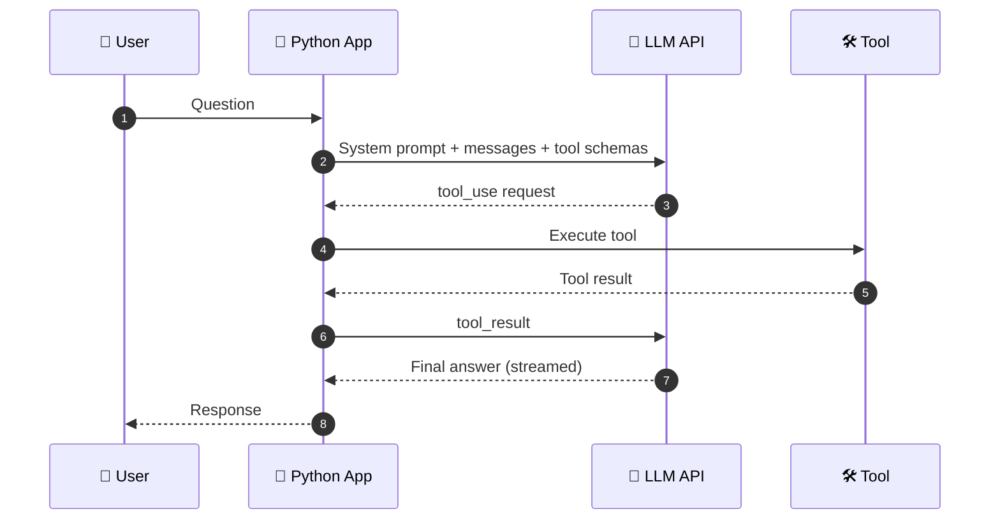

- 🧾 Messages API anatomy: system prompt, roles, temperature, max tokens
- 📐 **Structured outputs** — JSON schemas and Pydantic validation
- 🛠️ **Tool / function calling**
- 🌊 Streaming responses
- 💰 Token counting, **prompt caching**, and cost optimization
- 🔁 Error handling: rate limits, timeouts, retries, fallbacks across models
- ✍️ Prompt engineering: few-shot, chain-of-thought, role prompting, prompt templates

---

## 🔢 Vector DBs

| | 🐘 **PGVector** | 🦅 **Milvus** |
|---|---|---|
| Type | PostgreSQL extension | Purpose-built distributed vector DB |
| Best for | Apps already on Postgres, moderate scale, SQL + vectors together | Very large scale, high-throughput similarity search |
| Indexes | HNSW, IVFFlat | HNSW, IVF, DiskANN, GPU indexes |
| Filtering | Full SQL `WHERE` clauses | Scalar/metadata filtering |
| Ops | Managed via RDS / Aurora | Self-hosted or Zilliz Cloud |

**Topics covered**
- 🔢 Embeddings: what they are, choosing a model, dimensions & cost
- 📏 Similarity metrics: cosine, dot product, L2
- ⚡ ANN indexes (HNSW vs IVF) and recall/latency trade-offs
- 🏷️ Metadata filtering and multi-tenancy
- 🔀 Hybrid search (vector + keyword / BM25)

---

## 📚 RAG Strategies

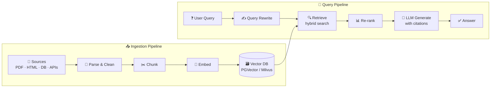

| Strategy | 💡 Idea | 📌 When to use |
|---|---|---|
| **Naive RAG** | Embed → retrieve top-k → generate | Baseline, small corpora |
| **Chunking strategies** | Fixed, recursive, semantic, document-aware | Always — biggest quality lever |
| **Hybrid search** | Vector + BM25 keyword fusion | Codes, IDs, exact terms |
| **Re-ranking** | Cross-encoder re-scores candidates | Precision matters |
| **Query rewriting / HyDE** | Rephrase or generate a hypothetical answer to search | Vague or short queries |
| **Parent-child / small-to-big** | Retrieve small chunks, return larger context | Long documents |
| **Contextual retrieval** | Prepend chunk-level context before embedding | Ambiguous chunks |
| **GraphRAG** | Knowledge graph of entities & relations | Multi-hop reasoning |
| **Agentic RAG** | Agent decides when/what/where to retrieve | Multiple sources, complex questions |

**📏 RAG Evaluation:** faithfulness, answer relevance, context precision/recall, golden datasets, LLM-as-judge (e.g., RAGAS).

---

## 🤖 Agents

- 🧩 What makes an agent: **LLM + tools + memory + loop**
- 🧠 Memory: short-term (conversation state) vs long-term (vector / SQL)
- 🗺️ Planning patterns: ReAct, plan-and-execute, reflection
- 👥 Multi-agent systems: supervisor/worker, router, handoffs
- ⚖️ Workflows vs agents — when *not* to use an agent

## 🔁 Agentic Loops

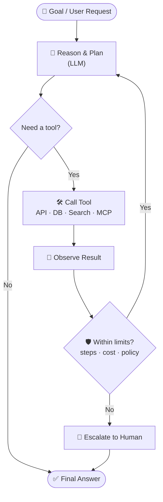

- 🔄 The core loop: reason → act → observe → repeat
- 🛑 Stop conditions: max iterations, budgets, confidence checks
- 🩹 Error recovery and self-correction
- 🙋 Human-in-the-loop checkpoints for risky actions

---

## 🔌 MCP — Model Context Protocol

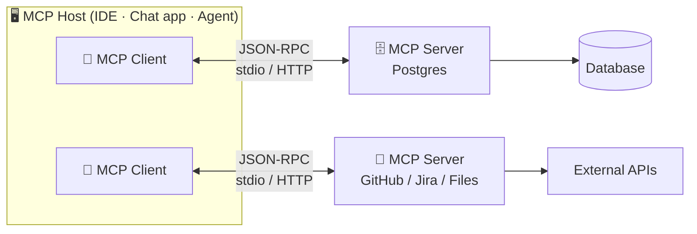

- 🧱 Architecture: hosts, clients, servers
- 🧰 Primitives: **Tools**, **Resources**, **Prompts**
- 🚚 Transports: stdio and streamable HTTP
- 🏗️ Building a custom MCP server in Python
- 🔐 Auth, permissions, and safe tool exposure
- 🔗 Using MCP servers from LangGraph and other agent frameworks

---

## 🛡️ Guardrails

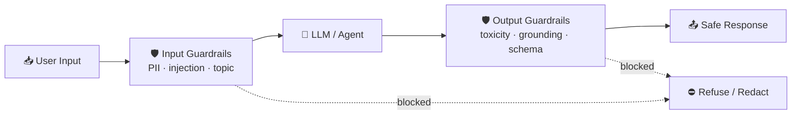

- 💉 Prompt-injection and jailbreak defenses (direct & indirect)
- 🕵️ PII detection and redaction
- 🎯 Topic restrictions and content filters
- 📚 Grounding / hallucination checks against retrieved context
- 🔒 Least-privilege tool access for agents
- 🧰 Tools: **Bedrock Guardrails**, NeMo Guardrails, Guardrails AI, custom validators
- 📜 Responsible AI and compliance basics (OWASP Top 10 for LLM Apps)

---

## ⚙️ MLOps / LLMOps

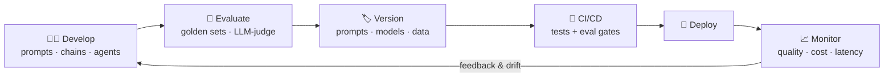

- 🏷️ Prompt and model versioning, experiment tracking (MLflow)
- 🧪 Offline evals and regression tests as CI gates
- 🅰️🅱️ A/B testing prompts and models
- 🔄 Data pipelines for continuous ingestion and re-indexing
- 🎛️ When to fine-tune vs prompt vs RAG

---

## 📈 Observability and Monitoring

- 🧵 **Tracing** every LLM call, tool call, and retrieval step (OpenTelemetry, LangSmith, Langfuse)
- 💰 Token usage and **cost** per user / feature
- ⏱️ Latency: time-to-first-token, end-to-end p95
- ✅ Quality signals: user feedback, eval scores, hallucination rate
- 🚨 Alerting on failures, cost spikes, and guardrail triggers
- 📊 Dashboards with CloudWatch / Grafana

---

## 🚢 Deployment

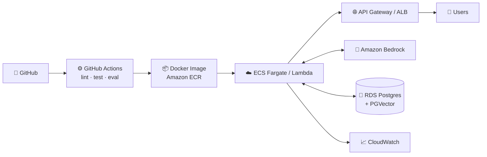

- 🐳 Containerizing AI apps with Docker
- 🌐 Serving with **FastAPI** — streaming endpoints (SSE / WebSockets)
- ☁️ AWS deployment: ECS Fargate, Lambda, API Gateway
- 🔑 Secrets management and IAM roles
- 🏗️ Infrastructure as Code (Terraform / CDK) basics
- 📏 Scaling, caching, and rate limiting
- 🖼️ Quick UIs with Streamlit / Gradio for demos

---

## 🏆 Capstone Project

Build and deploy an **end-to-end agentic AI application** that combines everything in the program.

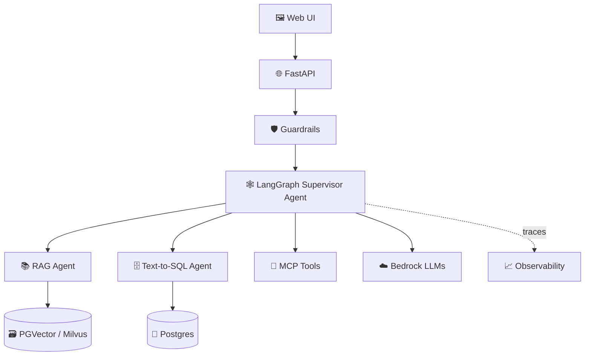

**💡 Sample capstone ideas**
- 🏢 Enterprise knowledge assistant over internal docs + databases
- 🧾 Invoice / contract processing agent with human approval
- 🎧 Customer support copilot with ticketing integration via MCP
- 📊 Natural-language analytics agent (Text-to-SQL + charts)

**✅ Capstone requirements**
- [ ] RAG over at least one real document corpus
- [ ] At least one agentic workflow built in LangGraph
- [ ] At least one custom MCP server or tool integration
- [ ] Input and output guardrails
- [ ] Tracing + cost/latency dashboard
- [ ] Evaluation suite with documented scores
- [ ] Deployed on AWS with CI/CD
- [ ] README, architecture diagram, and recorded demo

---

## 📝 Assessment

| Component | Weight |
|---|:---:|
| 🧪 Weekly labs & mini-projects | 40% |
| 📝 Quizzes & code reviews | 15% |
| 🏆 Capstone project | 35% |
| 🎤 Demo day presentation | 10% |

---

## 🎓 Learning Outcomes

By the end of the program you will be able to:

1. 💬 Integrate LLM APIs with tool calling, streaming, and structured outputs
2. 🔢 Design and operate vector search with PGVector and Milvus
3. 📚 Build, tune, and **evaluate** RAG systems using advanced retrieval strategies
4. 🤖 Implement agentic loops and multi-agent systems with LangGraph
5. 🔌 Build and consume MCP servers to connect AI to real tools and data
6. 🛡️ Apply guardrails and security practices to AI applications
7. 📈 Instrument AI apps for observability, cost, and quality monitoring
8. 🚢 Deploy production AI services on AWS with CI/CD

---

## 💼 Career Support

- 📄 Resume & LinkedIn review tailored to AI roles
- 🐙 GitHub portfolio with capstone + weekly projects
- 🎤 Mock technical interviews (system design for AI apps, coding, RAG/agent deep-dives)
- 🧭 Role-specific prep for AI Developer, AI Platform Engineer, and Forward Deployed Engineer tracks

---

## ✅ Prerequisites

- 🐍 Basic Python programming (functions, classes, packages)
- 🗄️ Basic SQL (SELECT, JOIN, GROUP BY)
- 💻 Comfortable with Git and the command line
- ☁️ An AWS account (free tier + Bedrock model access)
