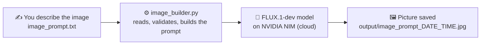
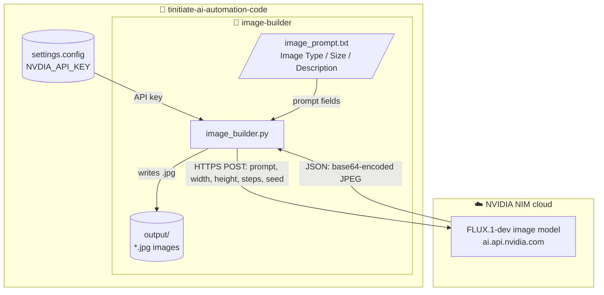
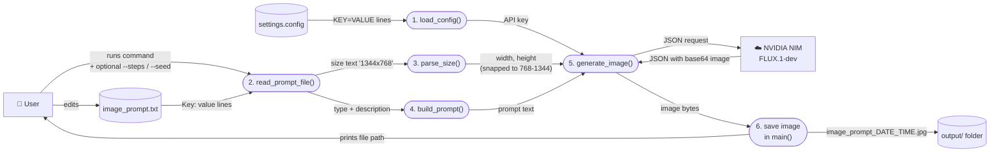
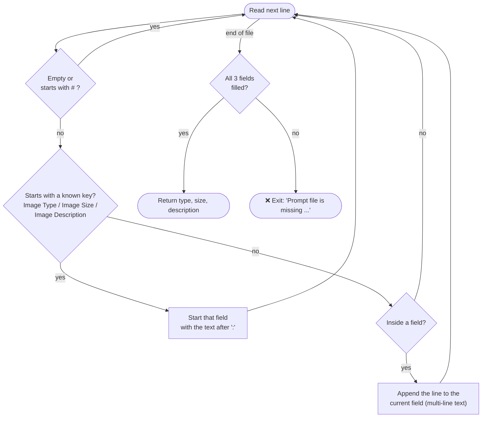
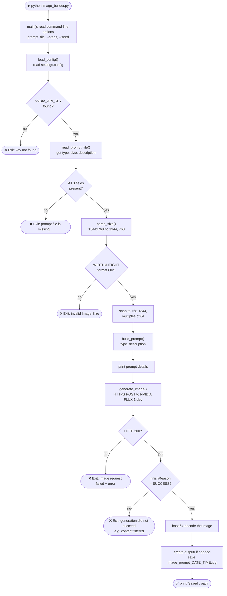
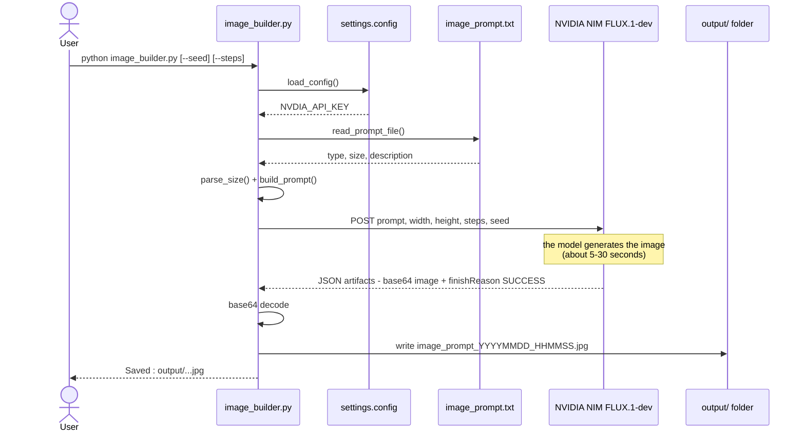

# Image Builder - Code Explainer

> (c) Venkata Bhattaram

## 1. Objective

Generate an image with **Generative AI** from a plain-text prompt file. There is no coding needed to
change the image; you only edit the prompt file.

You describe the image in `image_prompt.txt` (**type**, **size** and **description**). The script
`image_builder.py` reads it, sends it to the **FLUX.1-dev** image model hosted on **NVIDIA NIM**, and
saves the returned picture as a `.jpg` in the `output/` folder.



---

## 2. Files involved

| File / folder | Type | What it does |
|---|---|---|
| `image-builder/image_prompt.txt` | **Input** (you edit it) | Describes the image: `Image Type`, `Image Size`, `Image Description` |
| `settings.config` (repository root) | **Input** (secret) | Holds the API key line `NVDIA_API_KEY=nvapi-...` |
| `image-builder/image_builder.py` | **Code** | The whole program: reads the inputs, calls the AI model, saves the image |
| NVIDIA NIM - FLUX.1-dev | **External service** | The AI model that turns the text prompt into a picture |
| `image-builder/output/` | **Output** | Every generated image, named `<prompt file name>_<YYYYMMDD_HHMMSS>.jpg` |

### Architecture



---

## 3. Data flow diagram

The diagram follows the classic data flow notation:
- **Rectangles** are external entities.
- **Rounded boxes** are processes (functions in `image_builder.py`).
- **Cylinders** are data stores.
- **Arrow labels** are the data that moves.



---

## 4. The code, function by function

`image_builder.py` has one job per function. `main()` calls them in order.

| # | Function | Input | Output | What it does |
|---|---|---|---|---|
| 1 | `load_config()` | `settings.config` | dictionary of keys | Reads every `KEY=VALUE` line, skips `#` comments, removes surrounding quotes from values |
| 2 | `read_prompt_file()` | `image_prompt.txt` | `{type, size, description}` | Reads `Key: value` lines. A line without a known key **continues** the previous field, so the description can span several lines. Stops with an error if a field is missing |
| 3 | `parse_size()` | `"1344x768"` | `(1344, 768)` | Checks the `WIDTHxHEIGHT` format and **snaps** each side to what FLUX accepts: 768 to 1344, in multiples of 64. Prints a note if it had to adjust |
| 4 | `build_prompt()` | type + description | one prompt string | Joins them: `"Anime Image. People in a fair"` |
| 5 | `generate_image()` | key, prompt, size, steps, seed | image bytes | Sends an HTTPS POST to NVIDIA, checks `finishReason == SUCCESS`, and decodes the base64 JPEG |
| 6 | `main()` | command-line arguments | `.jpg` file | Runs steps 1-5, prints progress, creates `output/` and saves the file with a timestamp |

### Important constants (top of the file)

| Constant | Value | Meaning |
|---|---|---|
| `CONFIG_FILE` | `../settings.config` | Where the API key is read from |
| `DEFAULT_PROMPT_FILE` | `image_prompt.txt` | Used when no prompt file is given on the command line |
| `OUTPUT_DIR` | `output/` | Where images are saved |
| `API_URL` | `https://ai.api.nvidia.com/v1/genai/black-forest-labs/flux.1-dev` | The FLUX.1-dev endpoint |
| `MIN_SIDE, MAX_SIDE, SIDE_STEP` | `768, 1344, 64` | Allowed image sizes |

### How the prompt file is read

Example `image_prompt.txt`:

```text
# comment lines are ignored
Image Type: Anime Image
Image Size: 1344x768
Image Description:
    People in a fair
```



### How the size is snapped

`round(n / 64) * 64`, then clamped between 768 and 1344:

| You write | Width x Height used | Why |
|---|---|---|
| `1344x768` | 1344 x 768 | Already valid |
| `1920x1080` | 1344 x 1088 | 1920 is above the maximum of 1344; 1080 rounds to 1088 |
| `500x500` | 768 x 768 | Below the minimum of 768 |

---

## 5. How to run

The script uses **only the Python standard library**, so there is nothing to install. Any Python 3.10
or newer works.

1. Put your NVIDIA key in `settings.config` at the repository root. Get one from
   <https://build.nvidia.com>.

   ```text
   NVDIA_API_KEY=nvapi-xxxxxxxxxxxxxxxx
   ```

2. Describe your image in `image-builder/image_prompt.txt`.
3. Run:

   ```powershell
   cd image-builder
   python image_builder.py                                # uses image_prompt.txt
   python image_builder.py my_prompt.txt                  # use another prompt file
   python image_builder.py --seed 42 --steps 30           # repeatable result, more detail
   ```

| Option | Default | Meaning |
|---|---|---|
| `prompt_file` | `image_prompt.txt` | Which prompt file to read |
| `--steps` | `30` | Diffusion steps (5-50). More steps give more detail but are slower |
| `--seed` | `0` | `0` gives a random image each time; any other number gives the same image again for the same prompt |

Example terminal output:

```text
Prompt file : C:\...\image-builder\image_prompt.txt
Image Type  : Anime Image
Image Size  : 1344x768
Prompt      : Anime Image. People in a fair

Generating image ...
Saved       : C:\...\image-builder\output\image_prompt_20260930_052546.jpg
```

---

## 6. Code execution flow

What happens, step by step, when you run `python image_builder.py`:



### The same flow as a sequence of messages



---

## 7. Errors you may see

| Message | Cause | Fix |
|---|---|---|
| `NVDIA_API_KEY not found in settings.config` | Key missing or misspelled | Add `NVDIA_API_KEY=...` to the repository-root `settings.config` (note the spelling `NVDIA`) |
| `Prompt file ... is missing: image size` | A field is empty or misspelled in the prompt file | Check the three `Key:` names |
| `Invalid Image Size '...'` | Size not written as `WIDTHxHEIGHT` | Use a format like `1024x768` |
| `Image request failed (401)` / `(403)` | Invalid or expired key, or no access to the model | Create a new key at <https://build.nvidia.com> |
| `Image generation did not succeed: CONTENT_FILTERED` | The prompt was blocked by the safety filter | Change the description |
| `Note: size ... adjusted to ...` | Not an error: the size was snapped to a supported value | Nothing to do |

> **Viewing the diagrams:** GitHub shows them automatically. In VS Code, install the
> *Markdown Preview Mermaid Support* extension, then open the preview with **Ctrl + Shift + V**.
