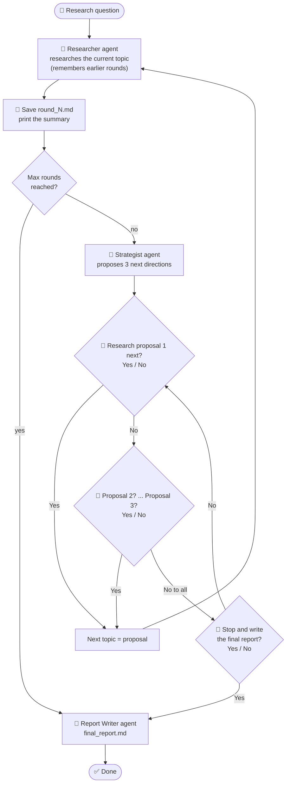

# Simple Agent Loop - Research with a Human in the Loop

> (c) Venkata Bhattaram

An **agentic loop**: the agents research a question in rounds. After every round they suggest where
to go next, and **you decide with Yes / No** whether to continue in that direction. It keeps going
until you stop it (or a safety limit is reached), and then writes a final report.

Compare with [`simple-agent`](../simple-agent), which runs each agent **once**, with no loop and no
human input.

## The agents

| Agent | Job in each round |
|---|---|
| **Researcher** | Researches the current topic, building on everything found in earlier rounds |
| **Research Strategist** | Reads the findings and proposes the 3 best directions for the next round |
| **You (human in the loop)** | Approve a direction with **Yes**, or say **No** to see the next proposal |
| **Report Writer** | When you stop, combines all rounds into one final report |

## How the loop works



Why this is an agentic loop:
- **Observe, decide, act, repeat:** each round's findings decide what happens next.
- **Memory:** each round sees a summary of all earlier rounds, so it builds on them instead of
  repeating them.
- **Human in the loop:** the agents *propose*, but only you *approve* the next step.
- **Safety stop:** `--max-rounds` (default 5) prevents an endless loop.

## Example session

```text
======================================================================
🔎 Round 1: How do AI agents use tools?
======================================================================
Researching ...

📝 AI agents call external tools through function calling, where the model outputs a structured
   request that the program executes and feeds back ...
   Full findings: round_1_how-do-ai-agents-use-tools.md

🧭 Proposal 1 of 3: Error handling when an agent's tool call fails
   Why: Reliability is the biggest open question from round 1.

👤 Research this next? (Yes/No): no

🧭 Proposal 2 of 3: How agents choose between many tools
   Why: Tool selection drives accuracy as the number of tools grows.

👤 Research this next? (Yes/No): yes

======================================================================
🔎 Round 2: How agents choose between many tools
...
👤 You declined all proposals. Stop the research and write the final report? (Yes/No): yes

📄 Writing the final report from 2 round(s) ...
✅ Done. Output folder: ...\output\20261001_101500_how-do-ai-agents-use-tools
```

## Output

Everything is saved in `output/<date_time>_<question>/`:

| File | Contents |
|---|---|
| `round_1_<topic>.md`, `round_2_<topic>.md`, ... | Each round's findings: summary, key findings, details, open questions |
| `research_log.md` | What was proposed in each round and what **you** decided |
| `final_report.md` | The Report Writer's answer to your original question, using all rounds |

## Setup (once)

Needs **Python 3.13** (CrewAI does not support 3.14 yet).

```powershell
cd simple-agent-loop
py -3.13 -m venv .venv
.venv\Scripts\Activate.ps1
pip install -r requirements.txt
```

The Groq key is read from `../settings.config`:

```text
GROQ_API_KEY=gsk_...
```

## Run

```powershell
python research_loop.py                                       # asks for your question
python research_loop.py "How do AI agents use tools?"
python research_loop.py "Solar energy in India" --max-rounds 3
```

Answer each question with `yes` / `y` or `no` / `n`.

> The agents research from the LLM's own knowledge; they do not browse the web. Treat recent facts
> and numbers as needing a check.
