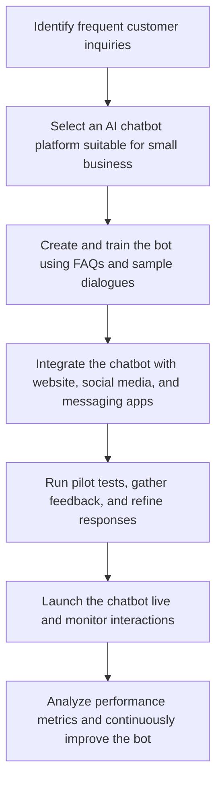

IMAGE PROMPT: A bright, modern small‑business office scene rendered in a clean flat‑design illustration style, featuring a friendly, semi‑transparent AI chatbot avatar hovering above a laptop screen displaying a chat interface. In the background, a diverse team of smiling employees works at desks, while subtle pastel blues, greens, and warm oranges create an inviting atmosphere. The composition includes visual cues of automation such as gear icons subtly integrated into the chatbot’s glow, and floating speech bubbles with simple question‑answer symbols, all without any textual labels.

CAPTION: A step‑by‑step guide to deploying AI chatbots that streamline customer service for small businesses.

WORKFLOW:

